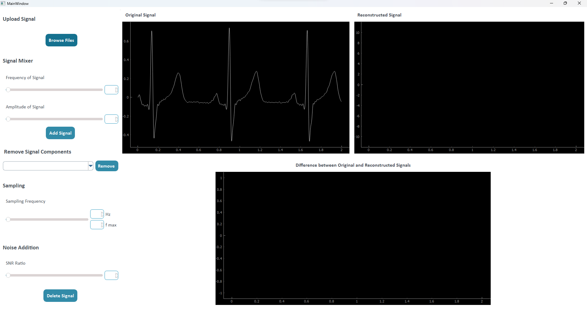
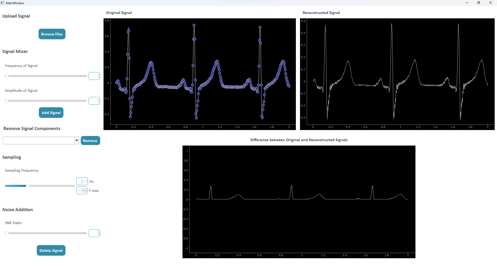
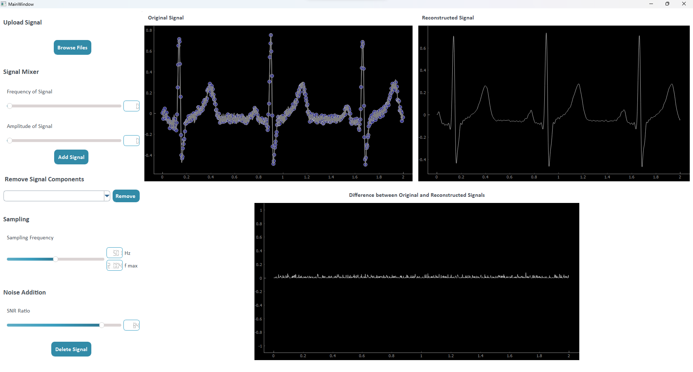
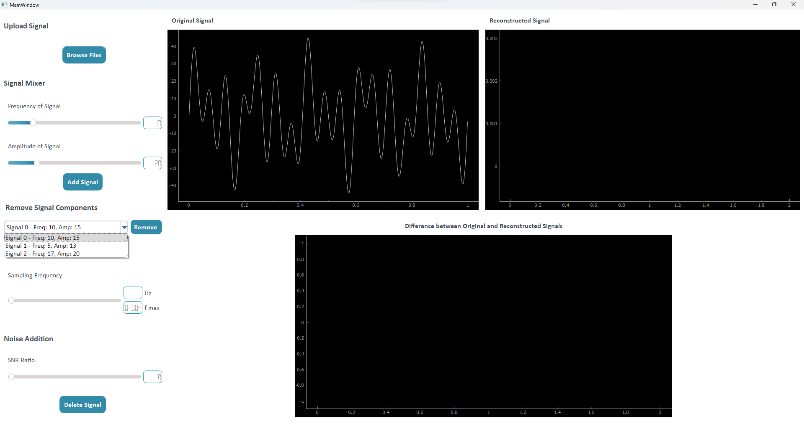
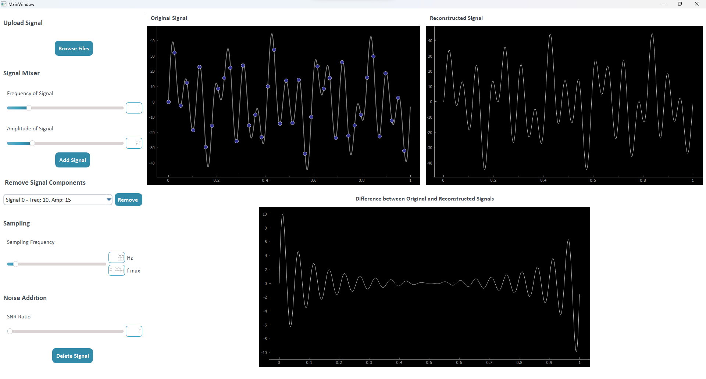

# Sampling Theory Studio

The Nyquist-Shannon sampling theorem plays a critical role in ensuring accurate signal recovery during the sampling process. It states that a signal can be perfectly reconstructed from its samples if the sampling frequency is at least twice the bandwidth of the signal.

## Description

This README provides and overview of the Sampling-Theory Studio desktop application. The application is designed to illustrate signal sampling and recovery. It includes various features to facilitate the understanding of signal processing concepts

## Features

1. **Sample and Recover**:

   - _Functionality_: allow user to either load a mid-lenth signal (approx. 1000 points) or compose his own signal.
   - _Visualization_: Using three graphs: one for displaying the original signal with sampled points marked, another for displaying the reconstructed signal, and a third for showing the difference between the original and reconstructed signals.

   * _Sampling Frequency Display_: shows the chosen sampling frequency using a slider in either actual frequency or normalized frequency

2. **Load & Compose**:

   - _Signal Loading_: user can load signal from files
   - _Signal Mixer_: user can add multiple sinusoidal signals of different frequencies and amplitudes, and remove components as needed.

3. **Additive Noise**:

   - Allow user to add noise to the signal using a slider for customizable SNR levels.

4. **Real-time Processing**:
   - Perform sampling and recovery in real-time without need for manual updates or refresh buttons.

Loading an ECG signal from files

Signal not fully reconstructed at < 2 fmax

Signal fully reconstructed at 2 fmax

Noise Addition

Signal Composition using Signal Mixer (Adding 3 sinusoidal signals with different frequencies and magnitudes)

Reconstruction of the signal

Removing 2 sinusoidal signals of 5Hz and 17Hz as well as adding noise using the slider

